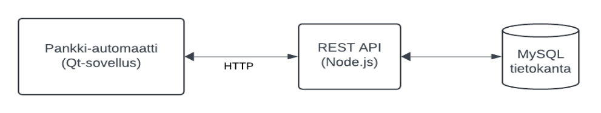

# Ohjelmistokehityksen sovellusprojekti (SPL ja SPO)

- Opiskelijoiden tehtävä on suunnitella ja toteuttaa pankkiautomaattijärjestelmä: [**Yleisohje ja arviointi**](#pr_ohje)
- 4 opiskelijan ryhmät määritellään [Excel-dokumentissa](<https://unioulu-my.sharepoint.com/:x:/g/personal/alaluuk_oamk_fi/IQBgHAzlTg22TYgV7PycCmFeAbtyxjCUqFPvKd9RjO1HQjc?e=hFPzhm>)
- [**Projektin alustaminen**](#initialize)

### Kahden ensimmäisen viikon ohjelma

Kaikki luennot pidetään tietoliikennelabrassa, mutta niihin voi osallistua myös etäyhteydellä kunkin ohjaajan ilmoittaman linkin kautta.
<table>
  <thead>
    <tr><th>Aika</th><th>Sisältö</th></tr>
  </thead>
  <tbody>
    <tr><td>Ma 9.3 klo 9–15</td><td>klo 9–11 Aloitusinfo<br>klo 12–15 Pekka (Git ja repon alustus)</td></tr>
    <tr><td>Ti 10.3 klo 9–15</td><td>klo 9–11 Pekka (Tietokannan suunnittelu + Backend)<br>klo 12:30–15:30 Kari (Qt)</td></tr>
    <tr><td>Ke 11.3 klo 9–15</td><td>klo 9-12 Pekka (Qt HTTP) <br> Ryhmätyötä</td></tr>
    <tr><td>To 12.3 klo 10–15</td><td>Teemu (Ohjelmistokehitys) + ohjausta</td></tr>
    <tr><td>Pe 13.3 klo 9–15</td><td>Ryhmätyötä (ER-kaavio palautetaan)</td></tr>
  </tbody>
</table>

<br>

<table>
  <thead>
    <tr><th>Aika</th><th>Sisältö</th></tr>
  </thead>
  <tbody>
    <tr><td>Ma 16.3 klo 9–16</td><td>klo 9-11 Ryhmätyötä<br>klo 13-16 Kari (Qt)</td></tr>
    <tr><td>Ti 17.3 klo 10–14</td><td>Teemu (Ohjelmistokehitys) + ohjausta</td></tr>
    <tr><td>Ke 18.3 klo 9–15</td><td>Ryhmätyötä (ER-kaavio valmis)</td></tr>
    <tr><td>To 19.3 klo 9–15</td><td>Ryhmätyötä (1. palaverit: tarkistetaan GitHub)</td></tr>
    <tr><td>Pe 20.3 klo 9–15</td><td>Ryhmätyötä (1. palaverit: tarkistetaan GitHub)</td></tr>
  </tbody>
</table>


Kolmannesta viikosta alkaen ryhmät työskentelevät joka päivä klo 9-15.

### Oikopolut eri viikoille

- [Viikko 1](./#viikko-1)
- [Viikko 2](./#viikko-2)
- [Viikko 3](./#viikko-3)
- [Viikko 4](./#viikko-4)
- [Viikko 5](./#viikko-5)
- [Viikko 6](./#viikko-6)
- [Viikko 7](./#viikko-7)
- [Viikko 8](./#viikko-8)

### Ohjaajien kommentteja ja vinkkejä

- Tänne on kasattu aikaisempien projektien [ohjaajien kommentteja ja vinkkejä](./dl/kommentit.md)

### Projektista

- Minimikomponentit (ohjelmisto):
  - Tietokanta (MySQL)
  - Node.js-rajapinta (API) MySQL-tietokantaan
  - Käyttöliittymä (Qt-työpöytäsovellus C++:lla)
- 4 hengen ryhmät
- Versionhallinta (Git + Github)
- Projektidokumentti
- Tekninen määrittelydokumentti
- Readme.md -tiedosto Github-repositorylle (etusivu)
- MS Teams viestintään
- Viikkopalaverit
- Loppuesitykset videona ja englanninkielinen posteri

Avainsanoja: UML/määrittelyt, Qt, API, MySQL, UI/UX


### Oppimistavoitteet

- Opiskelija tunnistaa ja ymmärtää ohjelmistokehityksen vaihejakomallin perusvaiheet. Hän tietää eri vaiheiden merkitykset, vaihetuotteet ja vaiheiden erot
- Itsenäisen ja ryhmätyöskentelyn avulla opiskelija oppii suunnittelemaan ja toteuttamaan vaatimusmäärittelyn mukaisen järjestelmän käyttäen moderneja kehitystyökaluja
- Opiskelija ymmärtää ryhmätyöskentelyn merkityksen ohjelmistokehitystyössä
- Opiskelija osaa käyttää oliopohjaista mallinnuskieltä kehitystyön (UML) eri vaiheissa ja osaa kirjoittaa kaavioiden pohjalta ohjelmakoodia
- Opiskelija osaa suunnitella ja toteuttaa oliopohjaisen sovelluksen luokkakirjaston mukaisesti
- Opiskelija osaa suunnitella ja toteuttaa sovellukseen tietokanta-arkkitehtuurin
- Opiskelija osaa laatia ohjelmistoprojektin dokumentaation ja pystyy viestimään suullisesti ja kirjallisesti, myös englanniksi

### Generatiiviset tekoälyt (AI-koodaus) ja vastaavat apuvälineet. Ohjaajien (ja yleisestikin IT-opettajien) ajatuksia aiheesta:

- Tekoäly on hyvä renki, mutta huono isäntä. Varsinkin oppimisessa.
- Tekoälyäkin pitää oppia hyödyntämään, mutta vähän myöhemmin
- Ensin on kuitenkin syytä opiskella perusteet, oli se sitten vaikkapa IT arkkitehtuurista, ohjelmistotekniikan perusteista, tietoverkoista, tietoturvallisuudesta, tietosuojasta, dokumentoinnoista, elektroniikasta yms.
- Työnantajat tuskin palkkaavat tuhansia euroja kuussa maksavaa työntekijöitä, jotka ovat pelkästään tekoälykonttoristeja
- Perusasioiden ymmärrys ei katoa mihinkään ja onhan se myös ammattiylpeyttä suunnitella ja käsittää mitä tapahtuu milloinkin
- Me ohjaajina emme halua arvioida tekoälyn tekemää sovellusta ja tekemistä, vaan opiskelijoiden. Emme myöskään ryhdy poliisiksi, joka käyttää työaikansa tekoälyn jäljittämiseen, vaan **opiskelijalla on oltava itsellään halu oppia eikä tavoitella pelkästään arvosanoja**
- Tämän projektikurssin ohjaajia yhdistää vuosikymmeniä kestänyt innostus ja kiinnostus tietotekniikkaan ja uteliaisuus oppia ja kokeilla uutta. Myös teköälyalustoja, jotka on vain uusi mielenkiintoinen vaihe tietotekniikan historiassa. Emme todellakaan ole tekoälyvastaisia, vaan päin vastoin. Niitä on hyvä ja tärkeää oppia hyödyntämään, mutta ei siten että perusteet jää oppimatta!

### Arviointi

Opiskelijan arviointi perustuu:

- Aikataulussa pysyminen. Työtä pitää tehdä järjestelmällisesti. Viikkoraportointi vaaditaan!
- Jokaisen ryhmän jäsenen pitää osata kertoa omasta tekemisestä viikkopalaverissa
- Ohjaajan arvioon (tämä perustuu palavereissa saatuihin kokemuksiin ja GitHubin näkymiin)
- Ryhmän tuottaman sovellukseen tasoon (kts. Sovelluksen arviointi)
- Toveriarvioon, joka tehdään web-sovelluksella (vertaisarviointi)
- Itsearvioon, joka tehdään web-sovelluksella (itsearviointi)
- Projektidokumentointi ja tekninen määrittelydokumentti (heikko dokumentointi voi alentaa arvosanaa)
- Englanninkielinen posteri (hyväksytty/hylätty, pitää päästä läpi)
- Loppuesitykseen
- Arvosanaa ei voi korottaa myöhemmin

Lisätehtäviä parempaan arvosanaan:

- Arvosanaan 5 vaaditaan lisäominaisuuksia (arvosanaa korottavat lisätehtävät on määritelty tarkemmin kohdassa "Yleisohje ja arviointi"). Katso [**Yleisohje ja arviointi**](#pr_ohje)


### Qt/Express-materiaalit (Pekka Alaluukas)

- Pekka Alaluukkaan [ohjeet ja tallenteet videosoittolistana](https://www.youtube.com/playlist?list=PLWl0bS7jZq99iOUNmMyuT9EgU6YfxP_en)
- Git perusteita [Peatutor.com/git_tutor/](https://peatutor.com/git_tutor/)
- Muita Pekan tekemiä ohjeita (Qt yms.): [Peatutor.com/](https://peatutor.com/)

### Ohjelmistokehityksen perusteet ja UML-mallinnus videot Yujassa (Teemu Leppänen)

- Teemu Leppäsen luentotallenteet [videosoittolista \(kevät 2025\)](https://oulu.cloud.panopto.eu/Panopto/Pages/Sessions/List.aspx#folderID=%2221064f4a-0801-451c-8e5c-b29d00e337be%22)
- Teamsissa [oppimateriaalit-kanava](<https://unioulu.sharepoint.com/:f:/r/sites/Ohjelmistokehityksensovellusprojektitestialusta/Shared%20Documents/3.%20Tiedostot%20ja%20yleiset%20oppimateriaalit?csf=1&web=1&e=hbYrc3>)

### Esimerkkisovelluksen UML-kaaviot

- Pekan luennoilla rakennetaan esimerkkisovellus, jonka UML-kaaviot ja muut suunnitteluvaiheet löytyvät GiHubista [https://github.com/alaluuk/peppiExample](https://github.com/alaluuk/peppiExample)


### Kaaviot dokumentointiin

Esimerkiksi näillä työkaluilla:

- Drawio: [https://www.drawio.com/](https://www.drawio.com/). Suora linkki: [https://app.diagrams.net/](https://app.diagrams.net/)
- Lucidchart: [https://www.lucidchart.com](https://www.lucidchart.com)
- Diagrameditor: [https://www.diagrameditor.com/](https://www.diagrameditor.com/)
- PlantUML: [https://plantuml.com/](https://plantuml.com/)

Katso näistä Teams-kanavan dokumenteista mallia teknisen määrittelydokumentin kaavioihin:

- Ohjelmistokehityksen [materiaalit](<https://unioulu.sharepoint.com/:f:/r/sites/Ohjelmistokehityksensovellusprojektitestialusta/Shared%20Documents/3.%20Tiedostot%20ja%20yleiset%20oppimateriaalit/Ohjelmistokehityksen%20materiaalit?csf=1&web=1&e=T5e6e4>)
- Valmiita esimerkkejä [määrittelyvaiheen kaavioista](<https://unioulu.sharepoint.com/:b:/r/sites/Ohjelmistokehityksensovellusprojektitestialusta/Shared%20Documents/3.%20Tiedostot%20ja%20yleiset%20oppimateriaalit/Ohjelmistokehityksen%20materiaalit/IN00CS90_Luku_5_Maarittelyvaihe.pdf?csf=1&web=1&e=TnPtge>)
- UML-mallinnuksen [kaavioesimerkit](<https://unioulu.sharepoint.com/:f:/r/sites/Ohjelmistokehityksensovellusprojektitestialusta/Shared%20Documents/3.%20Tiedostot%20ja%20yleiset%20oppimateriaalit/Ohjelmistokehityksen%20materiaalit/UML-mallinnus?csf=1&web=1&e=0UrXUt>)
- Yleinen [esimerkkikuva järjestelmäarkkitehtuurista](./dl/arkkitehtuurikuva.png)


## Noin 10-15 min viikkopalavereiden yleinen agenda

- Pääsääntöisesti kaikkien pitää olla paikalla
- Yleistä keskustelua, että miten projekti on edennyt
- Yleistä keskustelua, että miten kukin opiskelija on osallistunut (eli jokainen opiskelija kertoo itse mitä on tehnyt kuluneen viikon aikana)
- Versiohallinnan esittely (ja .gitignore käytössä)
- Muutoksia arvosanatavoitteeseen tai tavoitteisiin ylipäätänsä
- Vilkaistaan projektidokumenttia ja teknistä määrittelyä

 <span id="pr_ohje"></span>
 
# Projektityön kuvaus

Työn aihe on pankkiautomaatti

## Ohjelmiston rakenne on seuraava



### Työ sisältää

- Tietokannan (MySQL/MariaDB)
- REST APIn (Node.js/Express.js)
- Pankkiautomaattisovelluksen (Qt työpöytäsovellus, jossa käytetään Qt Network moduulia)

**Huom!** Edellä mainitut kuuluvat kurssin sisältöön ja arviointi perustuu niiden osaamiseen, joten millään muilla tekniikoilla noita ei saa korvata.

## Sovelluksen toiminta

- Qt-sovellus kommunikoi REST APIn kanssa http-protokollan avulla.
- REST API hoitaa kommunikoinnin tietokannan kanssa.

## Sovelluksen arviointi

Arviointi perustuu tähän dokumenttiin. Mikäli ristiriitaista tietoa esiintyy, niin tämä dokumentti on se, jota noudatetaan.


### Vähimmäisvaatimukset sovellukselle (arvosana 1)

- Debit kortti toteutettava (ei luottoa, saldo ei saa mennä miinukselle)
- Qt-sovelluksen aloituskäyttöliittymä
- Kortinlukijan käyttö ja PIN-koodin syöttö
- Oikealla PIN-koodilla avautuu pääkäyttöliittymä, väärällä uudelleenkysely
- Saldon tarkastelu
- Rahan nosto: 20, 40, 50 tai 100 €
- Näytetään 10 viimeisintä tilitapahtumaa

### Vähimmäisvaatimukset (arvosana 2)

- PIN-koodin syötön aikaraja 10 sekuntia (jos koodia ei anneta 10 sekunnin aikana palataan aloituskäyttöliittymään)
- REST API:in on toteutettu kaikkien tietokanta-taulujen CRUD-operaatiot (vaikkei niitä tarvita pankkiautomaatissa)

### Hyvän arvosanan vaatimukset (arvosana 3)

- Kortti voi olla joko debit- tai credit -tyyppinen
- Credit-kortilla nosto luottorajan puitteissa
- Vapaavalintaisen summan nosto (automaatissa vain 20 ja 50 € seteleitä)
- Kolme väärää PIN-koodia lukitsee kortin (ei vaadita tallentamista tietokantaan)

### Hyvän arvosanan vaatimukset (arvosana 4)

- Korttilukitus tallennetaan tietokantaan (eli lukitus säilyy vaikka sovellus käynnistetään uudelleen)
- 30 sekunnin inaktiivisuus palauttaa alkutilaan (jos käyttäjä ei tee mitään 30 sekunnin aikana, palataan aloituskäyttöliittymään ja kaikki muut ikkunat suljetaan)
- Tilitapahtumien selaus (eteen/taakse, 10 tapahtumaa kerrallaan)

### Kiitettävän arvosanan vaatimukset (arvosana 5)

- Kaksoiskortit (debit + credit samassa kortissa)
- Kirjautuessa valinta: debit vai credit (vain jos kyseessä kaksoiskortti)
- Tilakaavio luotu
- **Lisäominaisuus** sovittava ohjaajan kanssa

(Huom! Kaksoiskortti on kytketty kahteen eri tiliin, joista toinen on debit-tili ja toinen credit-tili)

<span id="arvosana_tiiviste"></span>

### Tiivistelmä arvosanoille

Nämä ovat ohjelmistokokonaisuutta projektihallinnallisesta näkökulmasta koskevat minimit (arviointi):

|                            | 1  | 2  | 3  | 4  | 5  |
|----------------------------|----|----|----|----|----|
| Versionhallinnan käyttö    | x  | x  | x  | x  | x  |
| Viikkopalaverit            | x  | x  | x  | x  | x  |
| Tekninen määrittelydokum.  | x  | x  | x  | x  | x  |
| Projektisuunnitelma        | x  | x  | x  | x  | x  |
| ER-kaavio                  | x  | x  | x  | x  | x  |
| Readme.md                  | x  | x  | x  | x  | x  |

Nämä ovat itse ohjelmistokokonaisuutta koskevat minimit (arviointi):

|                            | 1  | 2  | 3  | 4  | 5  |
|----------------------------|----|----|----|----|----|
| Kortinlukija toimii        | x  | x  | x  | x  | x  |
| Kirjautuminen PIN-koodilla | x  | x  | x  | x  | x  |
| Saldon näyttö              | x  | x  | x  | x  | x  |
| Rahan nosto (20,40,50,100) | x  | x  | x  | x  | x  |
| Tilitapahtumien näyttö     | x  | x  | x  | x  | x  |
| Debit kortti               | x  | x  | x  | x  | x  |
| PIN-koodille 10 s timer    |    | x  | x  | x  | x  |
| Kaikki CRUD-operaatiot     |    | x  | x  | x  | x  |
| Credit kortti              |    |    | x  | x  | x  |
| Rahan nosto (muu summa)    |    |    | x  | x  | x  |
| PIN-lukitus istunnolle     |    |    | x  | x  | x  |
| PIN-lukitus tietokantaan   |    |    |    | x  | x  |
| 30 s timerit               |    |    |    | x  | x  |
| Tilitapahtumien selaus     |    |    |    | x  | x  |
| Tilakaavio                 |    |    |    | x  | x  |
| Kaksoiskortti              |    |    |    |    | x  |
| Lisäominaisuus             |    |    |    |    | x  |


#### Arvosanaa alentavia seikkoja

- Dokumentoinnin puutteet
- MVC-mallin noudattamatta jättäminen backendissä

## Vaatimukset tietokannalle

### Ilman credit-kortti ominaisuutta

- Useita tilejä asiakkaalla
- Yhdellä tilillä yksi omistaja
- Asiakkaalla voi olla tili ilman korttia
- Useita kortteja asiakkaalla, mutta yksi kortti → yksi tili
- Asiakastiedoissa: etunimi, sukunimi, osoite
- PIN-koodi hashattuna (bcrypt)

### Kun toteutetaan credit-kortti ominaisuus

- Credit-korteilla pitää olla luottoraja (credit-korteille ei tarvita erillistä taulua, jos debit-korteille laitetaan luottorajaksi nolla)


### Kun toteutetaan kaksoiskortti

- Kortilla pääsy useaan tiliin (debit ja credit)

### Lisäominaisuuksia tietokannalle

- Asiakkaalla käyttöoikeus toisen omistajan tilille

### Tileistä ja korteista

- Vaikka tässä tehdään pankkiautomaatti, niin tehdään tietokannasta kuitenkin oikeaa pankintietokantaa muistuttava. Eihän pankeilla ole erikseen tietokantaa pankkiautomaattien tileille. Siksi siis pitää voida luoda tilejä ja osalle niistä annetaan kortti osalle ei.
 
- Sellainen kortti, jossa on sekä debit, että credit ominaisuus toimii niin, että se on kytketty kahteen tiliin:
  - toinen on debit tili (se on asiakkaan oma tili)
  - toinen tili on credit tili (sen omistaa pankki ja asiakas ei näe sitä tiliä verkkopankissa)
  - tässä on siis kyseessä **monen-suhde-moneen yhteys**: 
    - yhdelle tilille voi olla pääsy monella kortilla: vaikkapa koko perheellä 
-yksi kortti on kytketty moneen eri tiliin (vaikka se on käytännössä korkeintaan kahteen tiliin(debit ja credit).
->Tästä seuraa hyvin tavanomainen RELAATIOTIETOKANNAN "pulma" joka  ratkaistaan välitystaulun avulla

## Opiskelijan arviointi

- Sovelluksen arvosana
- Vertais- ja itsearviointi
- Ohjaajien näkemys
- Githubin informaatio

### Arvioinnin kohteet

- Ryhmätyöskentely
- Itsenäinen työ
- Projektisitoutuminen
- Qt-ohjelmointi
- REST API -ohjelmointi
- Tehtävien vaikeustaso
- Gitin käyttö

## Lisäominaisuusideoita (arvosanan 5 tarvitaan vähintään yksi tällainen lisäominaisuus)

## Kuvan lataus ja näyttäminen

- Kuvan lataaminen backendiin ja näyttäminen Qt-sovelluksessa (vaikutus arvosanaan 1)

Idean esittelyvideo: [https://www.youtube.com/watch?v=DlKRlZTNYl8](https://www.youtube.com/watch?v=DlKRlZTNYl8)

### Toimintaperiaate:

- Tietokanta taulussa on tekstikenttä, johon tulee kuvan nimi (esim. `aku.jpg`).
- Kuva ladataan REST APIn kansioon (yleensä `public`-kansioon).
- Kuva kansioon pitää päästä esim. selaimella.
- Qt-sovelluksessa kuva näytetään `Label`-komponentissa.

REST APIssa voi käyttää [Multer-moduulia](https://www.npmjs.com/package/multer).

## Swagger dokumentointi

- Lisätään sovellukseen swagger-sivu (vaikutus arvosanaan 1)

Idean esittelyvideo: [https://www.youtube.com/watch?v=M6Fj5Y2K24w](https://www.youtube.com/watch?v=M6Fj5Y2K24w)  
[https://www.npmjs.com/package/swagger-ui-express](https://www.npmjs.com/package/swagger-ui-express)

## Logitus

- Tapahtumien logittaminen backendissä ja niiden näyttäminen jollakin tavalla (`morgan`-moduuli). Pelkkä logitus on aika helppo, joten sen vaikutus n. 0,5. Mutta jos keksitte siihen jotain lisää, niin sitten isompi vaikutus.

## WebSocket

Toteutetaan WebSocketeilla jokin toiminto sovellukseen (vaikutus arvosanaan 1).

- Node.js WebSocket: [https://www.npmjs.com/package/ws](https://www.npmjs.com/package/ws)
- Qt:n websocket-moduuli

Idean esittely: [https://youtu.be/QGnv7s0JIIo](https://youtu.be/QGnv7s0JIIo)

## Docker

Sovelluksen ajaminen Dockerissa (vaikutus arvosanaan 1).

- [https://youtu.be/DseMnAW0OTk](https://youtu.be/DseMnAW0OTk)

## Testien lisääminen backendiin

Esimerkiksi `jest` ja `supertest` (vaikutus arvosanaan 1)

Esittelyvideo: [https://youtu.be/HEZufcp2umI](https://youtu.be/HEZufcp2umI)

Tai Newman

Esittelyvideo: [https://youtu.be/Wvv8GWQdvKU](https://youtu.be/Wvv8GWQdvKU)

## CI/CD

- Jonkinlainen yksinkertainen CI/CD tai ainakin CD (esim. käännetyn tuotoksen "releasen" automatisointi Githubiin tai toiselle palvelimelle ladattavaksi vaikka Github actioneilla)
(vaikutus arvosanaan 1)

## Verkkopankin toteuttaminen

- Verkkopankin toteuttaminen (vaikutus arvosanaan 1)

## Ylimääräinen Qt-sovellus

- Qt-sovellus pankin henkilökunnalle. Sovelluksella voidaan esimerkiksi luoda uusia asiakkaita, tilejä ja kortteja jne. 
  
# Viikko 1

- Aloitusinfo
- Luodaan ja numeroidaan neljän opiskelijan ryhmät
- Jokainen opiskelija luo tunnuksen itselleen sivustolla
  [https://peatutor.com/project_app/register/tvt25spl](https://peatutor.com/project_app/register/tvt25spl) TAI [https://peatutor.com/project_app/register/tvt25spo](https://peatutor.com/project_app/register/tvt25spo)
    - Voit keksiä minkä hyvänsä tunnuksen
    - Rekisteröityä voi vain oamk.fi ja oulu.fi sähköposteilla
    - Luotuasi tunnuksen, saat sähköpostin, jossa on tunnuksesi ja salasanasi. Pidä ne tallessa.
- Tutustukaa arviointikriteereihin ja päättäkää mihin arvosanaan pyritään
- Tarkista että olet kurssin Teams-kanavalla (pyydä opettajalta pääsy jos et ole). Käytä students.oamk.fi-sähköpostiosoitetta kun kirjaudut Teamssiin
- Jokaisesta ryhmästä yksi luo kurssin Teams-kanavan **ALAISUUTEEN** (ei siis kokonaan uutta Teams-kanavaa) uuden YKSITYISEN alikanavan nimeltä:
  - Ryhmä-Lxx tai Ryhmä-Oxx SPL:n ryhmä 1:n kanava on nimeltään Ryhmä-L1 ja SPO:n ryhmä 1:n kanava on nimeltään on Ryhmä-O1, jne.
- Kun ryhmän Teams-kanava on luotu, lisää kanavalle ryhmän muut jäsenet. Lisää myös ohjaavat opettajat kanavan omistajaksi: Pekka Alaluukas, Jukka Jauhiainen, Kari Jyrkkä, Teemu Leppänen, Pasi Mustonen
- Github käyttöön (Pekan tekemän organisaation alle): [Pekan ohje](#initialize)
- Ryhmän jäsenet sopii alustavasti kuka tekee mitäkin toiminnallisuuksia (mutta ei niin, että vain yksi tekee koko Qt-työpöytäsovelluksen, että vain yksi tekee koko tietokannan jne.)
- Ryhmä sopii käytetäänko Qt sovelluksessa build järjestelmänä **qmake**:a vai **cmake**:a (on parasta että koko ryhmä käyttää samaa)
- Aloittakaa tekemään projektidokumenttia (pitää tehdä yhdessä). Pohja löytyy Teamsista. Tallentakaa oma versio ryhmän github-repositoryyn documents-hakemistoon.
- Aloittakaa tekemään teknistä määrittelydokumenttia (pitää tehdä yhdessä). Pohja löytyy Teamsista. Tallentakaa oma versio ryhmän github-repositoryyn documents-hakemistoon. 
- Katsokaa yhdessä valmiiksi viikon 2+ tavoitteet

- Tämän viikon aikana pitää olla tehtynä:
  - Projektisuunnitelma alulle
  - Tekninen määrittely-dokumentti alulle
  - Github repository käyttöön
  - Ryhmän Teams-kanava luotu kurssin Teams-kanavan alle. Ryhmän jäsenet ja opettajat lisätty privaattikanavan omistajiksi
  - Priorisoikaa backend (tietokanta ja API), jotta käyttöliittymän voi tehdä toimimaan suoraan sitä vasten
  - Tietokannan ER-kaavio pitää olla ohjeiden mukaisesti tehtynä ja ohjaajalle viesti Teamsin kautta (SPL:Jukka, SPO:Pekka). Laittakaa ER-kaavio Teamsin Files osioon ja postatkaa viesti (ryhmästä riippuen)
    - "@Jukka Jauhiainen ER-kaavio valmis".
    - "@Pekka Alaluukas ER-kaavio valmis".

**Vinkkejä tietokannan suunnitteluun**
  - Lukekaa [https://peatutor.com/databases/db.php#design](https://peatutor.com/databases/db.php#design) ja miettikää erityisesti **monen-suhde-moneen yhteydet**
  - Miettikää tietotyyppejä ja tässä apuna [https://peatutor.com/databases/mysql.php#types](https://peatutor.com/databases/mysql.php#types)

# Viikko 2

- Viikkopalaveri opettajan kanssa
  - Versiohallinnan esittely (Tarkistetaan että repository on alustettu)
  - Esitelkää mitä dokumentteihin (projektisuunnitelma, tekninen määrittely) on kirjattu tähän mennessä
- Sovelluksen tekemistä
- Tämän viikon aikana pitää olla tehtynä:
  - Ohjelmistokehityksen perusteet ja UML-mallinnus videot katsottuna: [Soittolista luentotallenteista](https://www.youtube.com/playlist?list=PLWl0bS7jZq99iOUNmMyuT9EgU6YfxP_en)
  - Projektisuunnitelma valmis.
  - Tekninen määrittely osin tehtynä: Järjestelmäarkkitehtuuri, Käyttötapaukset, Tietosisältö 
  - ER-kaavio hyväksytty

# Viikko 3

- Viikkopalaveri
  - Projektisuunnitelma kokonaan valmis
  - Tekninen määrittely: Järjestelmäarkkitehtuuri, Käyttötapaukset, Tietosisältö valmiina
  - Esitellään dokumentit
  - CRUD-operaatioista demo (Pitää olla jotain endpointteja backendissä)

- Kirjoita Github-projektille kuvaus markdownilla (readme.md-tiedosto). Github osaa prosessoida markdown-kieltä suoraan readme.md:stä HTML:ksi
  - Muista päivittää omaa projektikuvausta Githubissa (readme.md) myös myöhemmin!
  - Esimerkkejä [hyvistä readme-projektitiedostoista](https://github.com/matiassingers/awesome-readme)
  - Teemun tekemä yksinkertainen esimerkki: [https://github.com/t2946282/demoproject](https://github.com/t2946282/demoproject)
- Sovelluksen tekemistä
- Tämän viikon aikana pitää olla tehtynä:
  - Readme.md:n ensimmäinen versio repositorylle Githubissa
  - Backendissä endpointteja
  - Tehtyjen endpointtien testausta [Postmanilla](https://www.postman.com/) 

# Viikko 4

- Viikkopalaveri
  - Versiohallinnan esittely
- Sovelluksen tekemistä
- Teknisen määrittelydokumentin tekemistä
- Tämän viikon aikana pitää olla tehtynä:
  - Login endpoint backendissä (kortin numerolla ja oikealla PIN koodilla saadaan webtoken)
  - Vähintään pankkiautomaatin tarvitsemat endpointit backendissä 

# Viikko 5

- Viikkopalaveri
  - Versiohallinnan esittely
  - Nyt pitää olla jo Qt-sovelluksessa jotain omaa koodia
- Sovelluksen tekemistä
- Tämän viikon aikana pitää olla tehtynä:
  - Tekninen määrittelydokumentti kokonaan valmiiksi 
  - Kirjautuminen onnistuu Qt-sovelluksesta (ainakin kovakoodatulla kortin numerolla eli sarjaportinlukijan ei tarvitse olla valmis)
 
  
# Viikko 6

- Viikkopalaveri
  - Esitellään valmis tekninen määrittelydokumentti
  - Versiohallinnan esittely
  - Sovelluksen tekemistä

- Tämän viikon aikana pitää olla tehtynä:
  - Projektille kirjoitettu markdown-muotoinen Readme-tiedosto Githubiin
  - Kortinlukija toiminnassa


# Viikko 7

- Viikkopalaveri
  - Versiohallinnan esittely
- Sovelluksen tekemistä
- Demovideon valmistelu
- Ryhmä tekee yhdessä posterin englanniksi. Posteripohja löytyy Teamssista
- Ota posterista hyvälaatuinen kuvaruutukaappaus, lisää se kuvana Github-repositoryyn ja linkitä näkyväksi readme.md tiedostossa repositoryn etusivulla
- Tämän viikon aikana pitää olla tehtynä:
  - Posteri valmiiksi ja Teamssiin
  - Posteri Githubissa kuvana ja linkitetty readme.md:ssä repositoryn etusivulle

# Viikko 8

- Laadi vastaava taulukko kuin kohdassa [**Tiivistelmä arvosanoille**](#arvosana_tiiviste) ja rastita siihen oman toteutuksen suoritetut tehtävät
- Demovideo projektista:
  - Videon pituuden tulisi olla noin 5 minuuttia, missä ehtii yleensä näyttämään keskeiset osat applikaatiosta ja posterista.
  - Videon on oltava julkisesti saatavilla ilman kirjautumista
    - YouTubeen unlisted-videoksi (myös students.oamk.fi -tunnukset toimivat myös Youtubeen)
    - Älä aseta videon lupaa "YouTube-sisältö lapsille", koska se ei salli videon tallentamista YouTube-soittolistaan
    - Linkkaa videon URL ryhmän Teams-kanavalle
  - Luo 3-4 sivun PowerPoint- tai PDF-dokumentti tukemaan videon esitystä. Dokumentissa tulisi olla vähintään:
    - Mitkä olivat projektin tavoitteet
    - Tiivistelmä arvosanoille -taulukko
    - Ketkä osallistuivat projektiin ja mitä he tekivät (suunnilleen)
    - Mikä oli hyvää, mikä oli huonoa
    - Esitä dokumentin sisältö videon alussa
    - Kaikkien ei välttämättä tarvitse puhua videolla (mutta toki saa)
    - Näytä posteri videon lopuksi
    - Lisää PowerPoint- tai PDF-dokumentti Github-repositoryyn
  - Esittele pankkiautomaattiprojekti
- Loppuesitykset koko luokalle (osallistumispakko)
  - Ohjelman demonstrointi ja vapaata keskustelua
  - Posterin esittely
 

 <span id="initialize"></span>
# Projektin alustaminen

📺 Voit katsoa ohjevideon osoitteesta:  
[https://www.youtube.com/watch?v=_lfn6vsrOJY](https://www.youtube.com/watch?v=_lfn6vsrOJY)

---

## 1. Repositoryn alustaminen

Yksi ryhmän opiskelijoista alustaa GitHub-repositoryn seuraavasti:

```bash
# Kloonaa repon omalle koneelleen
git clone <repository-url> 

cd groupx  # jossa groupx on kloonattu kansio ja x oman ryhmän numero
git checkout -b initialize
```

---

## 2. Backendin alustaminen

Anna groupx kansiossa seuraavat komennot
```bash
mkdir backend
cd backend
npx express-generator --no-view
npm install
```

---

## 3. Qt-sovelluksen alustaminen

1. Käynnistä **Qt Creator**
2. Luo **Qt Widget** -tyyppinen sovellus, jonka nimeksi `bank-automat`
3. Tallenna sovellus kansioon `groupx`
4. Käännä sovellus
5. Tarkista, että `bank-automat`-kansion alle ilmestyi `build`-kansio
6. Jos `build`-kansiota ei ilmesty:
   - Poista `bank-automat`-kansio
   - Tarkista Qt:n asetukset:  
     [https://peatutor.com/c_kieli/qt_asennus.php](https://peatutor.com/c_kieli/qt_asennus.php)
   - Luo sovellus uudestaan

---

## 4. `.gitignore`-tiedoston luominen

Luo tiedosto projektikansion `groupx` juureen ja kirjoita siihen seuraavat rivit:

```gitignore
backend/node_modules/
bank-automat/build/
bank-automat/.qtcreator/
bank-automat/*.user 
```

---

## 5. Muutosten lisääminen ja pushaaminen

Suorita komennot kansion `groupx` juuressa:

```bash
git add .
git commit -m "projekti alustettu"
git push origin initialize
```

---

## 6. Tarkistukset GitHubissa

Varmista, että GitHubissa näkyy seuraavat kansiot:

✅ `backend`  
✅ `bank-automat`

Ja että seuraavat **eivät ole GitHubissa**:

❌ `backend/node_modules`  
❌ `bank-automat/build`  
❌ `bank-automat/xxx.user`
❌ `bank-automat/.qtcreator`

---

## 7. Pull Request

- Jos kaikki edellä meni oikein, tee **Pull Request**
- Pyydä jotain muuta ryhmän jäsentä hyväksymään PR ja yhdistämään `initialize` branchin `mainiin`

---

## 8. Branchin yhdistämisen jälkeen

### Henkilö, joka teki alustusvaiheet
- suorittaa komennot:

```bash
git checkout main
git pull origin main
```
- ja tämän jälkeen hän luo oman branchin


### Muut ryhmän jäsenet

- kloonaavat repositoryn
- luovat oman branchin
